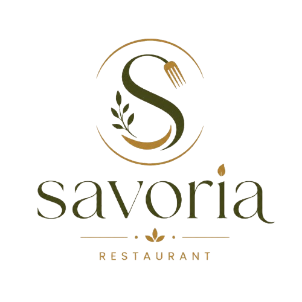
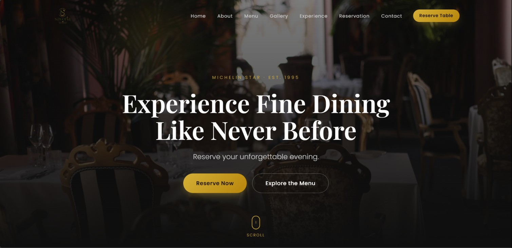
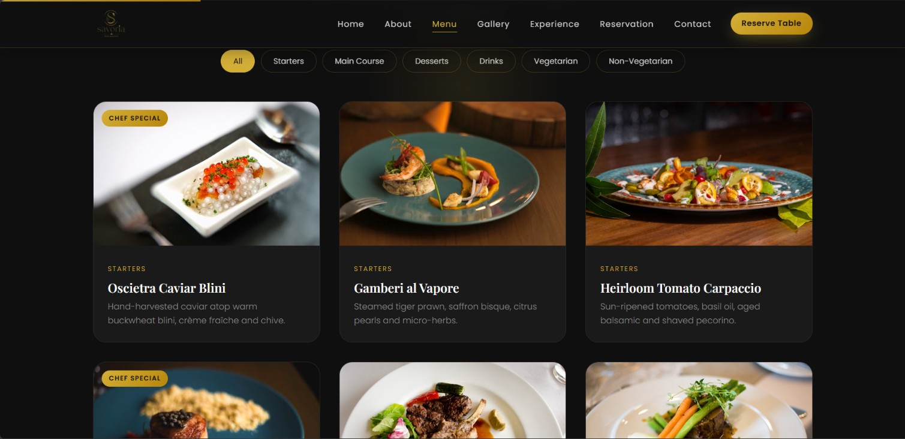
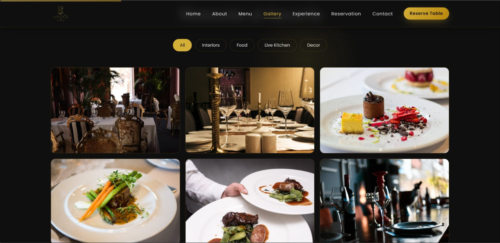
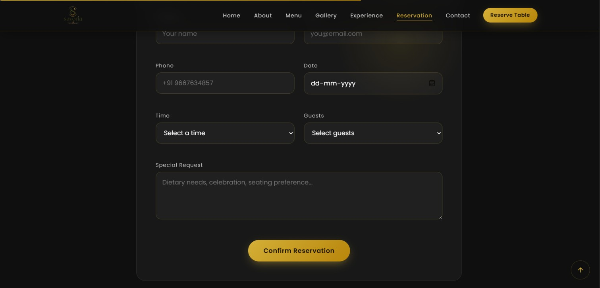
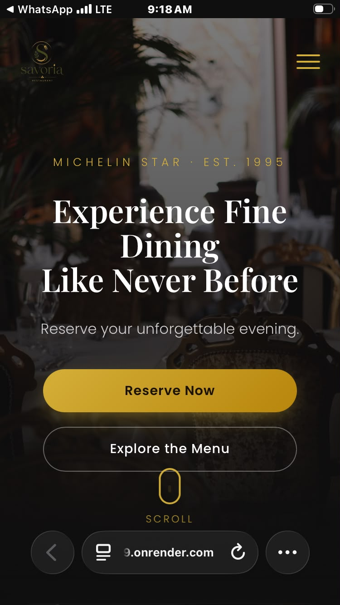
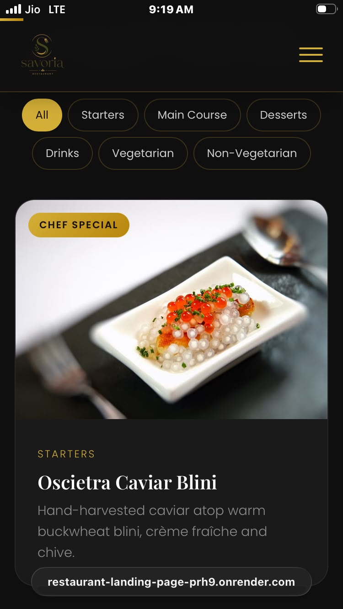
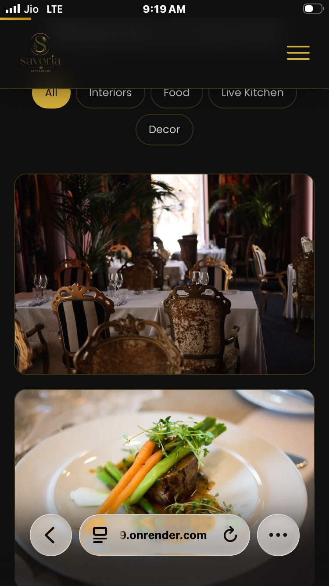
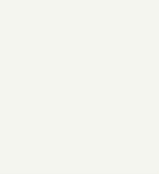

<div align="center">

<!-- LOGO PLACEHOLDER -->


# 🍷 Savoria — Premium Luxury Restaurant Website

### *Where Fine Dining Meets Modern Web Design*

<p>
  
  
  
</p>

<p>
  
  
  
  
</p>

**Savoria** is a fully responsive, animation-rich, multi-page luxury restaurant website built with pure **HTML5, CSS3, and Vanilla JavaScript** — featuring a refined **Black & Gold** design language, glassmorphism UI components, and buttery-smooth micro-interactions.


</div>

---

## 🌐 Live Demo

<div align="center">

### 👉 [**View Live Website**](https://restaurant-landing-page-prh9.onrender.com) 👈

</div>

| Environment | Link | Status |
|---|---|---|
| 🟢 Production | [https://restaurant-landing-page-prh9.onrender.com](https://savoria-restaurant.netlify.app) | Active |
| 🔵 GitHub Pages | [https://ayushyadav-engineer.github.io/Restaurant-Landing-Page/](https://ayushyadav.github.io/savoria) | Active |

---

## 📸 Screenshots

<div align="center">

| Home Page | Menu Page |
|:---:|:---:|
|  |  |

| Gallery Page | Reservation Page |
|:---:|:---:|
|  |  |

</div>

<details>
<summary><b>📱 View Mobile Screenshots</b></summary>

<div align="center">



</div>

</details>

---

## ✨ Features

<table>
<tr>
<td valign="top" width="50%">

### 🎨 UI / UX
- 🖤 Premium Black & Gold theme
- 🧊 Glassmorphism components
- ✍️ Elegant premium typography
- 🌊 Smooth scroll & scroll-triggered animations
- 🖱️ Rich hover & interactive states
- 📱 Fully responsive across all breakpoints

</td>
<td valign="top" width="50%">

### ⚙️ Functionality
- ⏳ Custom page loader
- 📊 Scroll progress bar
- ⬆️ Back-to-top button
- 🧭 Active navigation highlighting
- 🔢 Animated statistic counters
- 🍽️ Menu category filtering
- 🖼️ Gallery filtering + lightbox
- 📅 Reservation form with validation
- ✉️ Contact form with validation
- 💾 LocalStorage persistence

</td>
</tr>
</table>

---

## 🛠️ Technologies Used

| Technology | Purpose |
|---|---|
|  | Semantic page structure |
|  | Styling, animations, Grid/Flexbox layout |
|  | DOM interactivity & app logic |
|  | Premium typography |
|  | Iconography |

---

## 📁 Folder Structure

```bash
Restaurant Landing Page
├── screenshots/          
├── css/
│   ├── style.css             
│   ├── animations.css        
│   └── responsive.css        
├── js/
│   ├── data.js                
│   ├── gallery.js              
│   ├── main.js          
│   ├── menu.js               
│   └── reservation.js        
├── index.html                  
├── about.html                  
├── menu.html                   
├── gallery.html                 
├── reservation.html             
├── contact.html                  
├── .gitignore                      
├── LICENSE
├── logo.png
└── README.md
```

---

## ⚡ Installation

```bash
# 1. Clone the repository
git clone https://github.com/ayushyadav-engineer/Restaurant-Landing-Page

# 2. Navigate into the project directory
cd Restaurant Landing Page

# 3. Open with a live server (recommended)
# Using VS Code Live Server extension, or:
npx live-server
```

No build tools, package managers, or dependencies required — it's 100% vanilla.

---

## 🖥️ Usage

Simply open `index.html` in your browser, or serve the folder with any static file server. Navigate through **Home → About → Menu → Gallery → Reservation → Contact** using the responsive navigation bar.

---

## 🎨 Customization

<details>
<summary><b>Change Color Palette</b></summary>

Edit the CSS custom properties in `css/style.css`:

```css
:root {
  --color-primary: #0d0d0d;
  --color-accent: #d4af37;
  --color-text: #f5f5f5;
  --color-surface: rgba(255, 255, 255, 0.05);
}
```

</details>

<details>
<summary><b>Change Typography</b></summary>

Swap the Google Fonts import in the `<head>` of each HTML file and update the `--font-heading` / `--font-body` variables.

</details>

<details>
<summary><b>Update Content</b></summary>

Menu items, gallery images, and text content live directly in each page's HTML — no CMS or database required.

</details>

---

## 📱 Responsive Design

Built mobile-first with fluid breakpoints:

| Device | Breakpoint |
|---|---|
| 📱 Mobile | `< 576px` |
| 📱 Large Mobile | `576px – 768px` |
| 💻 Tablet | `768px – 992px` |
| 🖥️ Laptop | `992px – 1200px` |
| 🖥️ Desktop | `> 1200px` |

---

## 🚀 Performance

- ⚡ Zero external JS frameworks — pure vanilla for minimal payload
- 🖼️ Lazy-loaded images for faster initial paint
- 🎯 Optimized CSS with reusable custom properties
- 📦 Minimal HTTP requests

---

## 🌍 Browser Compatibility

| Chrome | Firefox | Safari | Edge | Opera |
|:---:|:---:|:---:|:---:|:---:|
| ✅ | ✅ | ✅ | ✅ | ✅ |

---

## 🎞️ Animations Used

- Fade-in / slide-up on scroll (Intersection Observer)
- Staggered card reveal animations
- Smooth hover transforms & glow effects
- Animated number counters
- Page loader transition
- Lightbox fade/zoom transitions

---

## 🧩 JavaScript Modules

| Module | Responsibility |
|---|---|
| `loader.js` | Handles initial page loader & fade-out |
| `navigation.js` | Mobile menu toggle, active link highlight |
| `scroll.js` | Scroll progress bar, back-to-top button |
| `counters.js` | Animates statistic counters on view |
| `gallery.js` | Gallery filtering & lightbox modal |
| `menu.js` | Menu category filtering |
| `forms.js` | Reservation & contact form validation |
| `storage.js` | LocalStorage read/write utilities |

---

## 📄 Pages Overview

| Page | Description |
|---|---|
| 🏠 **Home** | Hero section, highlights, animated counters, CTA |
| ℹ️ **About** | Restaurant story, chef profiles, philosophy |
| 🍽️ **Menu** | Filterable menu categories with pricing |
| 🖼️ **Gallery** | Filterable image gallery with lightbox |
| 📅 **Reservation** | Table booking form with validation |
| ✉️ **Contact** | Contact form, location map, business info |

---

## 🎨 Color Palette

<div align="center">

| Color | Hex | Preview |
|:------|:---:|:-------:|
| Onyx Black | `#0D0D0D` |  |
| Royal Gold | `#D4AF37` |  |
| Champagne | `#F5F5F0` |  |
| Charcoal | `#1A1A1A` |  |

</div>

## ✒️ Typography

| Role | Font | Usage |
|---|---|---|
| Headings | `Playfair Display` | Elegant serif for luxury feel |
| Body | `Poppins` | Clean modern sans-serif for readability |

---

## 🧭 Future Improvements

- [ ] Online ordering integration
- [ ] Multi-language support
- [ ] Dark/Light theme toggle
- [ ] CMS-based menu management
- [ ] Payment gateway for reservations
- [ ] PWA support

---

## ♿ Accessibility

- Semantic HTML5 landmarks
- ARIA labels on interactive elements
- Keyboard-navigable menus & forms
- Sufficient color contrast (WCAG AA)
- Focus-visible states throughout

---

## 🔍 SEO Improvements

- Semantic heading hierarchy
- Descriptive meta titles & descriptions per page
- Open Graph & Twitter Card meta tags
- Alt text on all images
- Clean, crawlable URL structure

---


## 🧹 Code Style

- 2-space indentation
- BEM-style CSS class naming
- `camelCase` for JavaScript variables/functions
- Semantic HTML5 elements

## 🔀 Git Workflow

We follow a simplified **GitHub Flow**: `main` is always deployable, feature work happens on `feature/*` branches, and merges into `main` are made via reviewed pull requests.

---

## 📜 License

Distributed under the **MIT License**. See [`LICENSE`](./LICENSE) for more information.

---

## 👤 Author

**Ayush Yadav**

<p>
  <a href="https://github.com/ayushyadav"></a>
  <a href="https://linkedin.com/in/ayushyadav"></a>
  <a href="mailto:ayush@example.com"></a>
</p>

## 🌟 Connect With Me

Feel free to reach out for collaborations, feedback, or just to say hi! 👋
