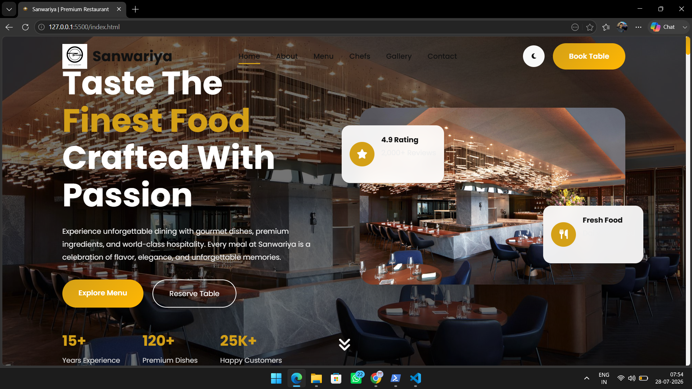
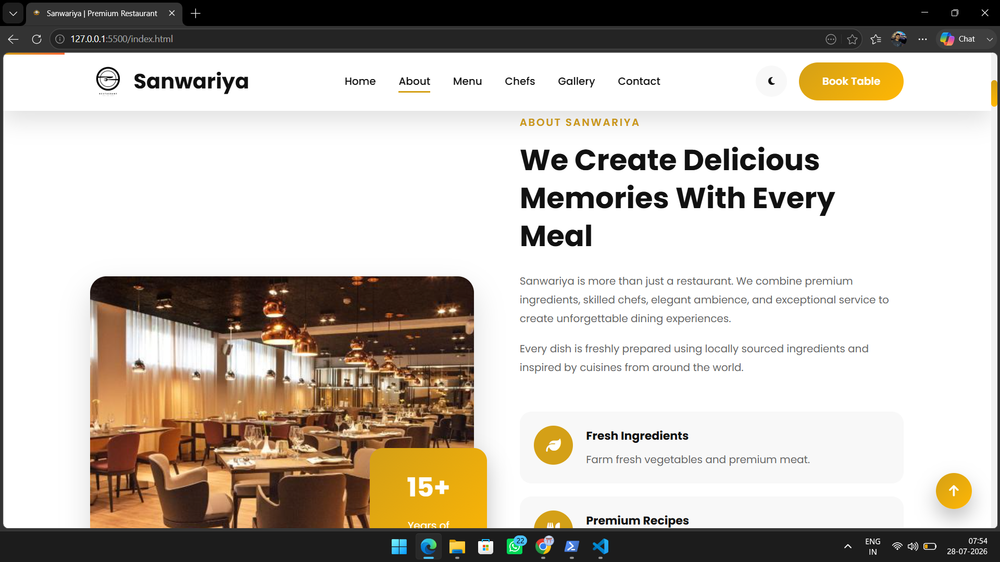
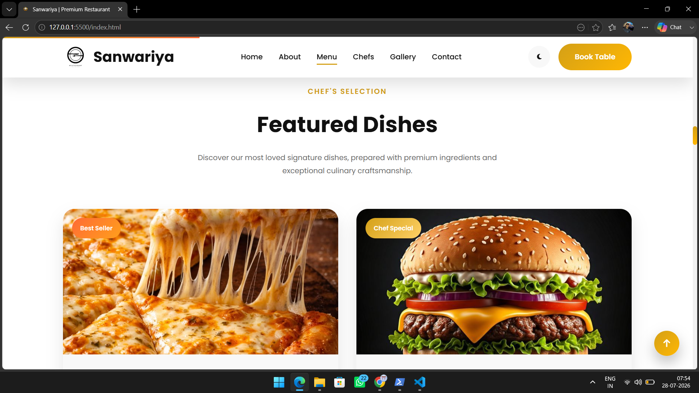
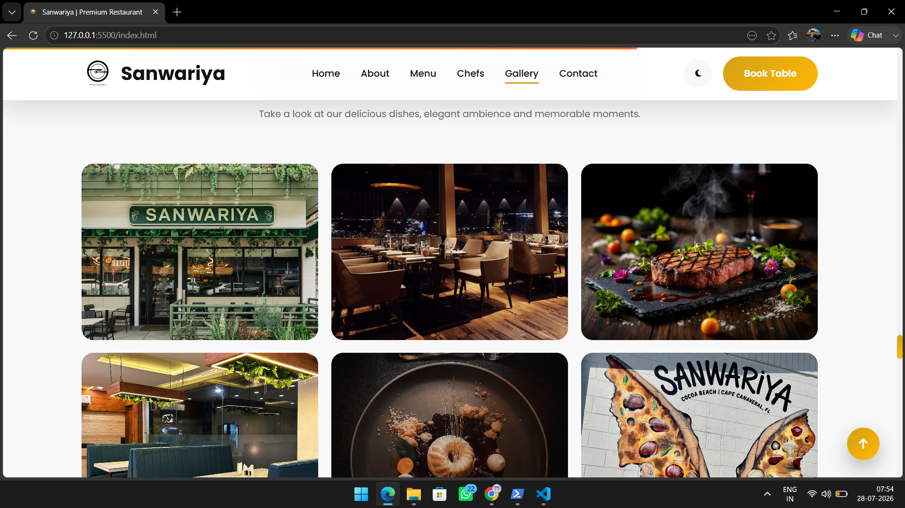
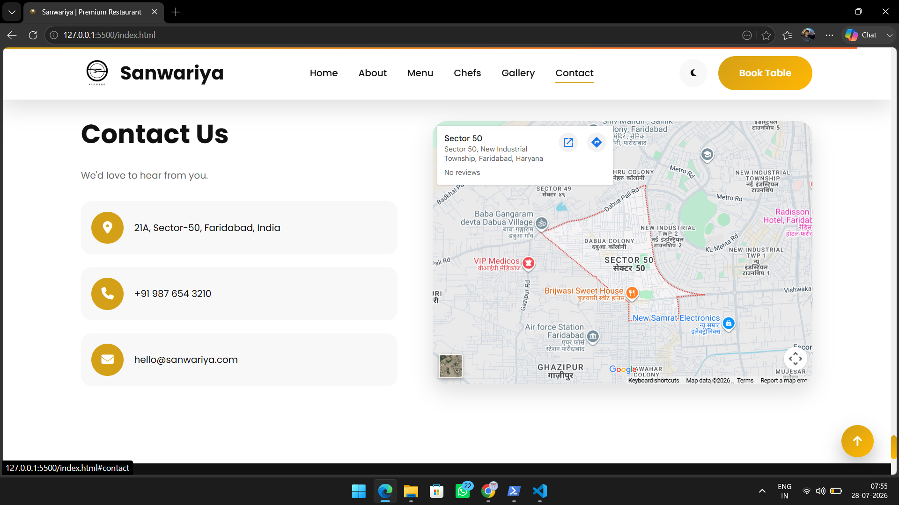

# 🍽️ Restaurant Landing Page

<div align="center">


### ✨ Modern • Responsive • Elegant Restaurant Website

A beautifully designed restaurant landing page built using **HTML5, CSS3, and JavaScript**. This project provides a premium restaurant experience with an attractive UI, responsive layout, smooth scrolling, and interactive sections.

🔗 **Live Demo:** https://ayushyadav-engineer.github.io/restaurant-landing-page/

⭐ **If you like this project, don't forget to star the repository!**

</div>

---

# 📸 Project Preview

## 🏠 Home Page

<p align="center">

</p>

---

## 🍴 About Section

<p align="center">

</p>

---

## 🍕 Featured Menu

<p align="center">

</p>

---

## 🖼️ Gallery

<p align="center">

</p>

---

## 📞 Contact Section

<p align="center">

</p>

---

# ✨ Features

- 🍽️ Modern Restaurant Landing Page
- 📱 Fully Responsive Design
- 🎨 Premium User Interface
- ⚡ Smooth Scrolling
- 🍕 Featured Food Menu
- 👨‍🍳 Professional Chef Section
- 🖼️ Restaurant Gallery
- ⭐ Customer Testimonials
- 📞 Contact & Location Section
- 🎯 Clean Navigation Bar
- 🚀 Fast Loading
- 💻 Cross-Browser Compatible

---

# 🛠️ Built With

- HTML5
- CSS3
- JavaScript (ES6)
- Google Fonts
- Font Awesome
- Responsive Web Design

---

# 📂 Project Structure

```
Restaurant-Landing-Page/
│
├── assets/
│   ├── images/
│   └── screenshots/
│       ├── home.png
│       ├── about.png
│       ├── menu.png
│       ├── gallery.png
│       └── contact.png
│
├── index.html
├── style.css
├── script.js
├── README.md
├── Structure.md
└── .gitignore
```

---

# 🚀 Getting Started

## Clone the Repository

```bash
git clone https://github.com/ayushyadav-engineer/restaurant-landing-page.git
```

## Navigate to the Project Folder

```bash
cd restaurant-landing-page
```

## Run the Project

Simply open

```
index.html
```

or use **VS Code Live Server** for the best development experience.

---

# 📱 Responsive Design

The website is fully optimized for:

- 💻 Desktop
- 💼 Laptop
- 📱 Mobile
- 📟 Tablet

---

# 🌟 Future Improvements

- 🍽️ Online Table Reservation
- 🛒 Food Ordering System
- 🌙 Dark Mode
- 🔐 Login & Registration
- 💳 Payment Gateway
- 📦 Backend Integration
- 📊 Admin Dashboard
- 📧 Newsletter Subscription

---

# 🤝 Contributing

Contributions are always welcome.

1. Fork this repository

2. Create your feature branch

```bash
git checkout -b feature/YourFeature
```

3. Commit your changes

```bash
git commit -m "Add new feature"
```

4. Push to the branch

```bash
git push origin feature/YourFeature
```

5. Open a Pull Request

---

# 📄 License

This project is licensed under the **MIT License**.

---

# 👨‍💻 Author

## Ayush Yadav

🎓 Computer Science Engineering Student

🌐 GitHub

https://github.com/ayushyadav-engineer

---

<div align="center">

### ⭐ Thank you for visiting this repository!

If you found this project helpful, please consider giving it a ⭐ on GitHub.

Made with ❤️ by **Ayush Yadav**

</div>